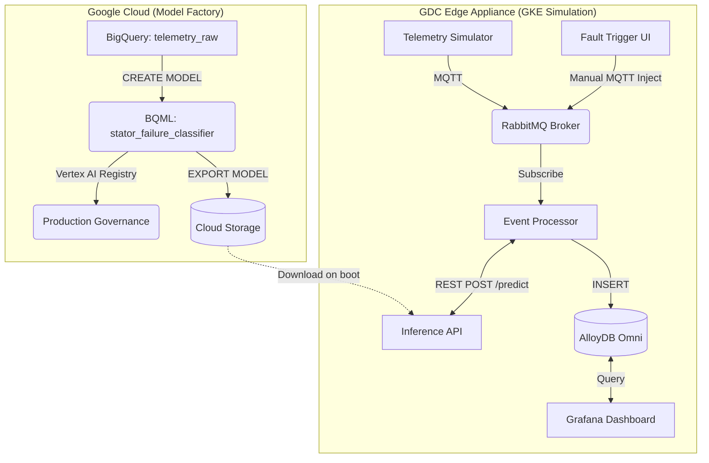

# GDC-PM: System Design & Demonstration Guide

This document describes the architectural layout, the simulated edge elements, and the user interface workflows for the Predictive Maintenance (GDC-PM) demonstration.

---

## 1. High-Level Architecture

The GDC-PM solution demonstrates an edge-native machine learning architecture deployed to a Google Distributed Cloud (GDC) environment (simulated via GKE Autopilot). 

The system relies on a **Cloud Model Factory** (BigQuery ML and Vertex AI) to train a `BOOSTED_TREE_CLASSIFIER` on historical sensor data. This model is then exported as a raw XGBoost artifact (`model.bst`) and deployed inside a container to the edge. 

At the edge, the model operates completely disconnected from the cloud, providing sub-millisecond, offline-capable failure predictions for local industrial assets.

---

## 2. Simulated Elements

### The Assets
The simulation models 5 high-value industrial assets (e.g., gas compressors or transformers) distributed across three substations:
1. `COMP-TX-VALLEY-01`
2. `COMP-TX-VALLEY-02`
3. `COMP-TX-RIDGE-01`
4. `COMP-TX-RIDGE-02`
5. `COMP-TX-BASIN-01`

### The Telemetry
Each asset emits a continuous stream of sensor readings every 5 seconds, modeling:
- **PSI (Pressure):** Internal fluid/gas pressure (Nominal ~855)
- **Temperature (°F):** Thermal load (Nominal ~112°)
- **Vibration (mm):** Mechanical stability (Nominal ~0.02mm)

### The Failure Classes
The BigQuery ML model is trained to recognize 4 distinct operational states:

1. **Normal (`normal`):**
   - Standard operating conditions with slight Gaussian noise to simulate sensor variance and long-term mechanical degradation (drift).
2. **PRD Failure (`prd_failure`):**
   - A catastrophic failure of a Pressure Relief Device.
   - *Signature:* Sudden, massive drop in pressure, sharp thermal spike, and violent vibration.
3. **Thermal Runaway (`thermal_runaway`):**
   - Dangerous overheating event.
   - *Signature:* Pressure remains nominal, but temperature climbs rapidly beyond 178°F. Moderate vibration increase.
4. **Bearing Wear (`bearing_wear`):**
   - A slow, progressive mechanical failure.
   - *Signature:* Pressure and temperature are largely nominal, but vibration slowly climbs out of band (>0.35mm).

---

## 3. The User Interfaces

### A. Grafana (Operations Dashboard)
**Purpose:** Real-time monitoring and alert visualization.
**Data Source:** AlloyDB Omni (querying the `telemetry_events` table).

The dashboard features:
- **Stat Panels (Top):** Aggregated counts of ML-detected alerts in the last 30 minutes, broken down by failure type (PRD, Thermal, Bearing).
- **Time-Series Charts (Middle):** Live scrolling line charts for PSI, Temperature, and Vibration, with color-coded threshold bands indicating safe vs. dangerous operating zones.
- **Detections Table (Bottom):** A rolling log of the last 50 events, highlighting any predicted failures alongside the XGBoost model's confidence score (e.g., `99.9%`).

### B. Fault Trigger UI (Demonstration Control Panel)
**Purpose:** Manual fault injection for live demonstrations.
**Data Source:** Direct MQTT publishing to the RabbitMQ broker.

The UI features:
- **Asset Selector:** Choose which of the 5 compressors to target.
- **Burst Control:** Define how many consecutive fault readings to inject (1-10) to ensure the anomaly registers cleanly on the Grafana charts.
- **Injection Buttons:** Color-coded buttons to instantly trigger a PRD Failure, Thermal Runaway, or Bearing Wear event.
- **Recent Events Log:** A live table showing the ML model's near-instantaneous reaction to the injected fault.

---

## 4. Recommended Demonstration Flow

When presenting the GDC-PM architecture to a stakeholder, use a dual-screen setup (Grafana on the main display, Fault Trigger UI on a secondary screen or tablet).

1. **Establish the Baseline:**
   - Show the Grafana dashboard. Point out the 5 assets humming along normally.
   - Explain that the `telemetry-simulator` is generating this data locally, and the `inference-api` (an XGBoost model trained in BigQuery) is scoring every packet locally on the GDC node.

2. **Demonstrate Predictive Capability (Bearing Wear):**
   - Point to the "Total Alerts" stat panel. It will likely show a few "Bearing Wear" alerts.
   - Explain that the simulator has a 12% natural failure rate programmed in. The ML model is catching these subtle, progressive vibration anomalies in the background without any human intervention.

3. **Demonstrate Reactive Capability (Thermal Runaway):**
   - Using the Fault Trigger UI, select `COMP-TX-RIDGE-01` and click **Thermal Runaway** (Burst: 5).
   - Direct attention back to Grafana. Within seconds, the Temperature chart will spike into the red zone, the "Thermal Runaway" stat counter will increment, and the event will populate in the Detections Table.
   - *Talking Point:* "Notice that pressure remained normal. A simple threshold alert on pressure would have missed this, but the ML model recognized the multivariate signature of a thermal event."

4. **Demonstrate Catastrophic Prevention (PRD Failure):**
   - Select `COMP-TX-VALLEY-01` and click **PRD Failure** (Burst: 5).
   - Watch the massive divergence across all three charts on Grafana.
   - *Talking Point:* "This model recognized the PRD pop in milliseconds locally at the edge. Because we aren't waiting for a round-trip to the cloud, the GDC appliance could use this inference to trigger an automated PLC shutdown of the compressor, saving the asset from destroying itself."
