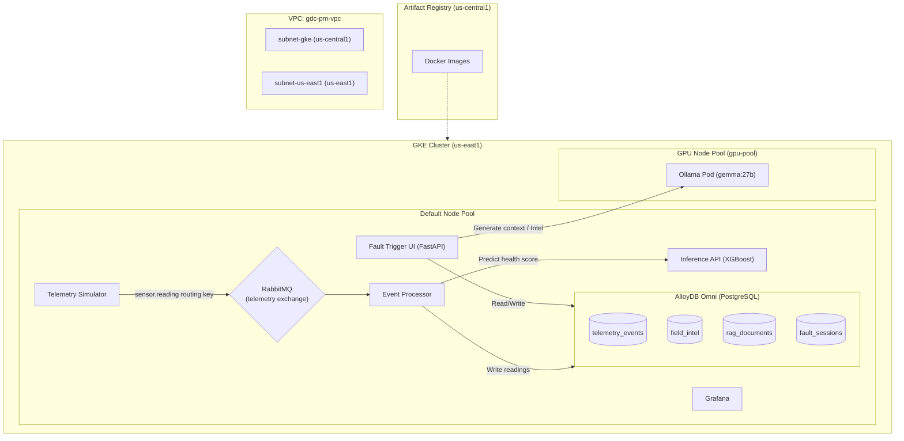

# GDC-PM Deploy-from-Scratch Runbook

This runbook provides step-by-step instructions for deploying the GDC-PM (Predictive Maintenance) simulation environment from scratch.

## Architecture Diagram Overview



## Prerequisites

- `gcloud`, `kubectl`, `terraform`, and `docker` installed.
- Valid GCP credentials (`gcloud auth login` and `gcloud auth application-default login`).
- Variables for project ID and cluster details configured in `gdc-pm/terraform/terraform.tfvars`.

## Deployment Steps

### 1. Provision Infrastructure via Terraform
This step creates the GKE cluster (in `us-east1` with default + `gpu-pool` node pools), BigQuery datasets, and GCS buckets.

```bash
cd gdc-pm/terraform
terraform init
terraform apply -auto-approve
```

### 2. Configure Kubectl & Namespace
```bash
# Retrieve credentials for the new cluster
gcloud container clusters get-credentials gdc-edge-simulation --region us-east1 --project <YOUR_PROJECT_ID>

# Create the dedicated namespace
kubectl create namespace gdc-pm
```

### 3. Create Secrets
The applications require secrets for RabbitMQ and AlloyDB. Ensure your `.secrets/` directory is populated:

```bash
cd gdc-pm/gke

# AlloyDB Secret
kubectl create secret generic alloydb-secret \
  --namespace=gdc-pm \
  --from-literal=password="$(cat ../.secrets/alloydb-password.txt)"

# RabbitMQ Secret
kubectl create secret generic rabbitmq-secret \
  --namespace=gdc-pm \
  --from-literal=username=gdc_user \
  --from-literal=password="$(cat ../.secrets/rabbitmq-password.txt)" \
  --from-literal=host="gdc-pm-rabbitmq.gdc-pm.svc.cluster.local" \
  --from-literal=port="5672" \
  --from-literal=vhost="gdc-pm"
```

### 4. IAM Permissions for Artifact Registry
The GKE compute service account needs permission to pull images from Artifact Registry (`us-central1-docker.pkg.dev/gdc-pm-v2/gdc-models`).

```bash
# Grant Artifact Registry Reader role to the default compute SA
PROJECT_NUM=$(gcloud projects describe <YOUR_PROJECT_ID> --format="value(projectNumber)")
gcloud projects add-iam-policy-binding <YOUR_PROJECT_ID> \
  --member="serviceAccount:${PROJECT_NUM}-compute@developer.gserviceaccount.com" \
  --role="roles/artifactregistry.reader"
```

### 5. Patch k8s Manifests (Image URLs)
Before deploying, patch the image placeholders in your Kubernetes manifests to use your actual Artifact Registry URLs.

```bash
REGISTRY="us-central1-docker.pkg.dev/gdc-pm-v2/gdc-models"
find gke -name "*.yaml" -type f -exec sed -i "s|GCR_IMAGE_PLACEHOLDER|${REGISTRY}|g" {} +
```

### 6. Service Deployment Order
Order is critical. Start with stateful services, then the messaging queue, then applications.

1. **AlloyDB Omni:**
   ```bash
   kubectl apply -f gke/alloydb-omni/
   ```
   *Wait for AlloyDB pod to become `Running`.*

2. **RabbitMQ:**
   Use the provided deployment script to install the operator and cluster:
   ```bash
   bash gke/rabbitmq/start-rabbitmq.sh
   ```
   *Wait for RabbitMQ to be ready.*

3. **Applications & UI:**
   Deploy the rest of the stack:
   ```bash
   kubectl apply -f gke/telemetry-simulator/
   kubectl apply -f gke/inference-api/
   kubectl apply -f gke/event-processor/
   kubectl apply -f gke/fault-trigger-ui/
   kubectl apply -f gke/grafana/
   ```

### 7. Deploy Ollama (GPU Workload)
Finally, start the GPU node pool and Ollama workload:

```bash
cd gdc-pm
./scripts/gpu-start.sh
```
- Provisions an `nvidia-l4` node in `us-east1`.
- Scales Ollama deployment to 1 replica.
- Pulls `gemma:27b` if not cached on PVC.
- Verify status with:
  ```bash
  kubectl exec -n gdc-pm deployment/ollama -- curl -sf http://localhost:11434/api/tags
  ```

### 8. Verification Checklist
- [ ] **Pods Running:** Run `kubectl get pods -n gdc-pm`. All pods should be `1/1 Running` (or `Completed` for schemas).
- [ ] **RabbitMQ Connection:** Check Event Processor logs to ensure AMQP connection is successful (`kubectl logs -n gdc-pm deployment/event-processor`).
- [ ] **AlloyDB Data:**
  ```bash
  kubectl exec -n gdc-pm deployment/alloydb-omni -- psql -U postgres -d grid_reliability -c "SELECT COUNT(*) FROM rag_documents;"
  ```
  *(Should return 11 rows).*
- [ ] **Ollama Model:** The API endpoint `/api/mlops/status` should show `ollama_online: True` and `model: gemma:27b`.
- [ ] **UI:** Access the live IP of the `fault-trigger-ui` Service on port 80 (or load balancer). Validate SCADA charts are loading and no errors are present.

## Troubleshooting / Potential Blockers

- **Event Processor CrashLoopBackOff:** If RabbitMQ is not fully ready when the `event-processor` pod starts, it may enter a `CrashLoopBackOff` state due to `socket.gaierror: [Errno -2] Name or service not known` or AMQP connection failures.
  **Fix:** Wait for the `rabbitmq` pod to become ready, then delete the crashing pod to force a clean restart:
  ```bash
  kubectl delete pod -l app=event-processor -n gdc-pm
  ```

- **Kubernetes Caching Stale Docker Images:** If you push a new image with the `:latest` tag and restart the deployment, nodes may not pull the new code if `imagePullPolicy` defaults to `IfNotPresent`.
  **Fix:** Force GKE to always pull the image by patching the deployment:
  ```bash
  kubectl patch deployment fault-trigger-ui -n gdc-pm -p '{"spec": {"template": {"spec": {"containers": [{"name": "fault-trigger-ui", "imagePullPolicy": "Always"}]}}}}'
  ```
  (Do this for any other services like `inference-api` or `telemetry-simulator` if developing iteratively).

- **Inference API Returning 503:** If the `event-processor` starts throwing `503 Service Unavailable` when calling `inference-api`, the model might not be fully loaded into memory yet, or it may have crashed.
  **Fix:** Restart the inference API deployment:
  ```bash
  kubectl rollout restart deployment/inference-api -n gdc-pm
  ```
